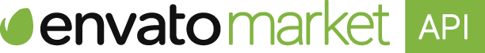
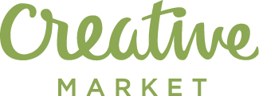
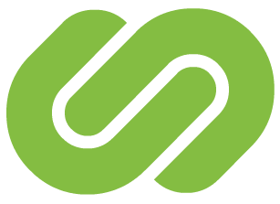
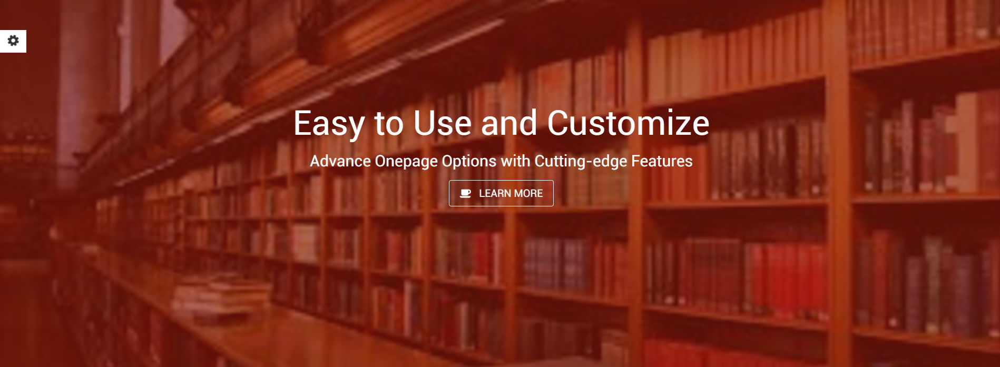

# Meet Eat Read

<!-- BADGES/ -->

  

  

 

  

  

  

  

  

  

 

  

  

  

  

  

  

<!-- /BADGES -->

The Meet Eat Read Template is a flexible template. This is an easy to use template, where one can showcase of your information and content on a template. The navigation includes automatic transitions, or next and previous buttons. Its usage may vary from a image, banner, carousel or content presenter. This was developed using HTML, CSS and JavaScript, and it is mostly customizable, from size, font, and all the different time durations.

The Template includes a dedicated folder for the Image Source and for the Assets.

### Feature List

- Include 12 Months of support by CalliTech.

### Project Information

##### Buy

[CodeGrape](http://www.codegrape.com/item/meet-eat-read/8169)

##### Test Page

Please visit our [Test Page](http://mer.calli.tech/) and see the project working:

  

##### Date

11/01/2016

##### Authors

Bruno Oliveira ([bruno-oliveira](https://github.com/bruno-oliveira))

##### Editors

Francisco Maria Calisto ([FMCalisto](https://github.com/FMCalisto))

Bruno Cardoso ([bdcardoso](https://github.com/bdcardoso))

#### License

For more details about our License agreement please read the [LICENSE](https://github.com/CalliTechDev/meetEatRead/blob/master/LICENSE.md).
